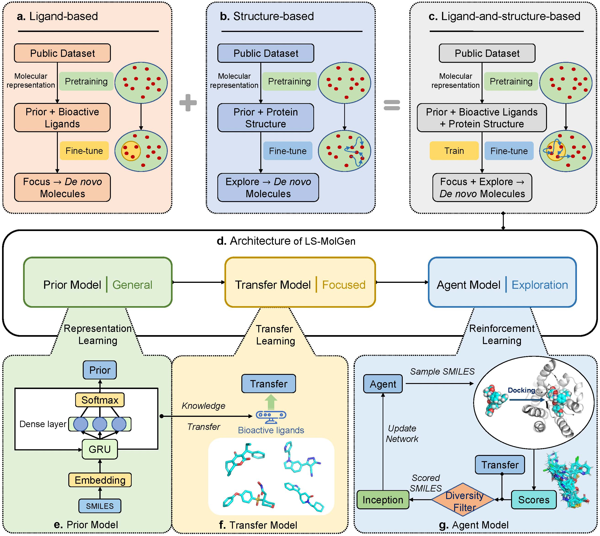

# LS-MolGen
The LS-MolGen model integrates ligand and protein structural information to generate molecules for specific targets, combining representation learning, transfer learning, and reinforcement learning approaches. During the representation learning phase, the model masters the general rules of SMILES strings, focusing on the chemical space of biologically active ligands. Through transfer learning, the model is guided to areas in the chemical space with similar or higher binding affinity to known ligands. In the reinforcement learning stage, the model explores and discovers potential, high-value chemical spaces under the guidance of molecular docking scores and diversity filters.
You can click on this [link](https://github.com/songleee/LS-MolGen) to get the complete code.

