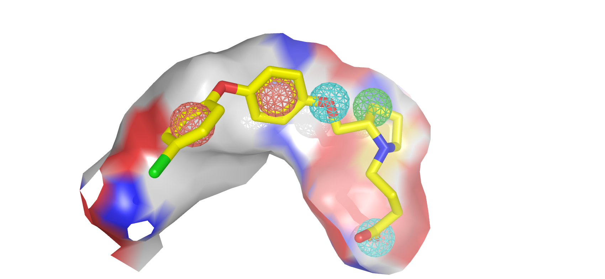

# PGMG
PGMG aims to provide a flexible strategy to generate bioactive molecules with structural diversity in various scenarios, especially when the activity data is scarce.

PGMG only requires a pharmacophore hypothesis as input. The hypothesis can be constructed using only a few ligands or the structure of the receptor or the ligand-receptor complex. The pharmacophore hypothesis will be transformed into a weighted complete graph based on the shortest-path distance and feed into the model. The model will then rapidly generate a large number of mol
ecules that satisfy the conditions.

You can click on this [link](https://github.com/CSUBioGroup/PGMG/tree/main) to get the complete code.

