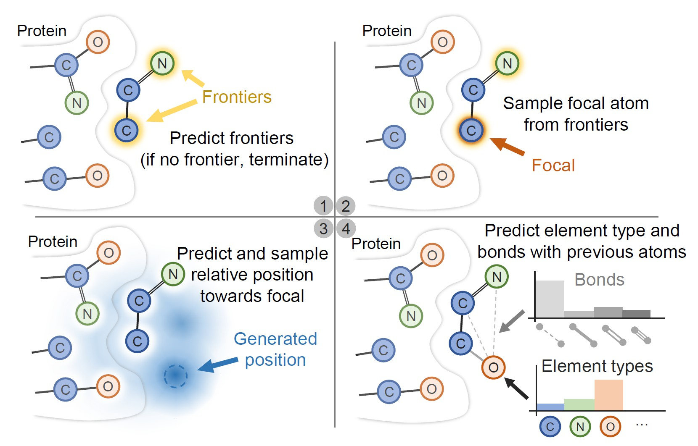

# Pocket2Mol: Efficient Molecular Sampling Based on 3D Protein Pockets

[Pocket2Mol](https://arxiv.org/abs/2205.07249) used equivariant graph neural networks to improve efficiency and molecule quality of [previous structure-based drug design model](https://arxiv.org/abs/2203.10446).
You can click on this [link](https://github.com/pengxingang/Pocket2Mol/tree/main) to get the complete code.

